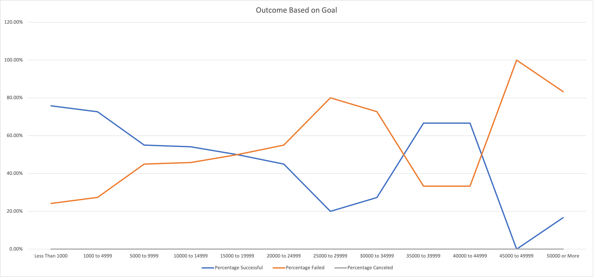

# Kickstarting with Excel

## Overview of Project

### Purpose
The purpose of this analysis is to show Louise how her play *Fever* compared to other plays in terms of their launch dates and overall funding goals.

## Analysis and Challenges

### Analysis of Outcomes Based on Launch Date
Analysis for this began with creating a pivot table to organize all Kickstarters by the month they were launched and their outcome. Then, the table was filtered to just show the Kickstarter campaigns relating to the theater parent category. See the pivot table below.

Then, a chart was made from the pivot table in order to better visualize the data gathered.

### Analysis of Outcomes Based on Goals
This sections analysis began with creating an 8x12 table and propagating it with data relating to the outcome of Kickstarter plays. See the table below.

In order to gather the data for the Number Successful, Number Failed, and Number Canceled columns, the `=COUNTIFS` Excel function had to be used. Below are three example uses of this function.
- Less Than 1000 `=COUNTIFS(Kickstarter!$F:$F, "successful", Kickstarter!$D:$D, "<1000", Kickstarter!$R:$R, "plays")`
- 25,000 to 29,999 `=COUNTIFS(Kickstarter!$F:$F, "successful", Kickstarter!$D:$D, ">=25000", Kickstarter!$D:$D, "<=29999", Kickstarter!$R:$R, "plays")`
- 50,000 or More `=COUNTIFS(Kickstarter!$F:$F, "successful", Kickstarter!$D:$D, ">50000", Kickstarter!$R:$R, "plays")`

Each of these examples gathers a range of data such as `Kickstarter!$F:$F` and applies a filter to it like `"successful"`. Once all the required data was gathered, a line chart was made to visualize the percentage outcome based on the Kickstarter's goal range. See below.

### Challenges and Difficulties Encountered
One challenge I encountered during the analysis of this data was figuring out how to use the `=COUNTIFS` function. I had never used it before, but was able to quickly understand its usage after looking up an example. One difficulty someone might encounter when creating the pivot table is how to get the months to show in each row rather than the years. The solutions is rather simple, all that's needed is to deselect the years and quarters from the row and what's left are the months.

## Results
 - When looking at the outcomes based on launch date, one can see that the best time to have a successful Kickstarter would be either May or June. Meanwhile July, October, and December are seemingly the worst times to launch your campaign. July and October have the same number of failed campaigns, while with December the ratio between successful and failed campaigns is nearly 1:1.

- One can see that the highest number of successful campaigns is between 1,000 and 4,999 at a 72.66% success rate. Meanwhile campaigns with goals between 25,000 and 34,999 have a fail rate of roughly 80%. Not only that, but campaigns with goals greater than 45,000 also have a very high fail rate of 83-100%.

- Louise is based out of Great Britain, but most of the data is from other countries. While there may be some overlap, having data in the most relevant market will give you the best look at what the market wants. For example, people in GB may be more inclined to fund a theater Kickstarter, whereas people in the US may like funding movies instead.

- In order to verify what I've just said above about differing markets, one could create tables and charts comparing markets to try to find similar interests. The Spotlight data also wasn't used, so visualizing how Kickstarter's spotlight feature affects a campaign could also be beneficial.
